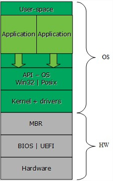
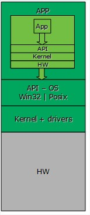
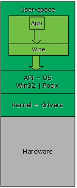
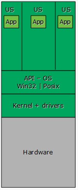
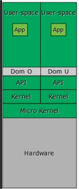
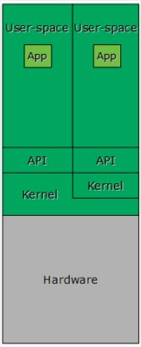
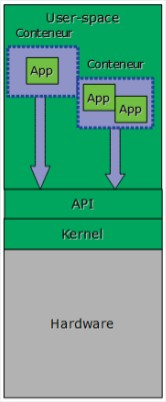

# Acronyme

```
HW : Hardware
US : User Space
K  : Kernel
```

# NATIF



# EMULATION



**Avantages :**

- Emulation du hardward
- Plus simple aux devs d'avoir accès au noyau (debug/coder...)

**Inconvénients :**

- Perte de 50% de performances car on passe 2 fois par API+Kernel+HW

***Exemples de logiciels :***
- VirtualBox (sans Hardware)
- VirtualPC
- VMware (sans ESX)

# TRANSLATION



**Avantages :**

- Très peu de perte de performance ( ≈2% )
- On peut éxécuter des apps windows sur un Linux

***Exemples de logiciels :***

- Wine

# ISOLATION



**Avantages :**

- Très peu de perte de performance ( ≈1% )
- Conteneurs (Hardware)

***Exemples de logiciels :***

- VServer
- virtuozzo
- Jail

# HyperV Type1 (Hyperviseur)



**Avantages :**

- De très bonne performance par rapport à l'émulation ( ≈7% )

***Exemples de logiciels :***

- Xen
- VmWare (ESX)

# HyperV Type2 (Hyperviseur)



***Exemples de logiciels :***

- Kvm

# Conteneur




**Avantages :**

- Très peu de perte de performance ( ≈1% )

***Exemples de logiciels :***

- Docker
- Rocket
